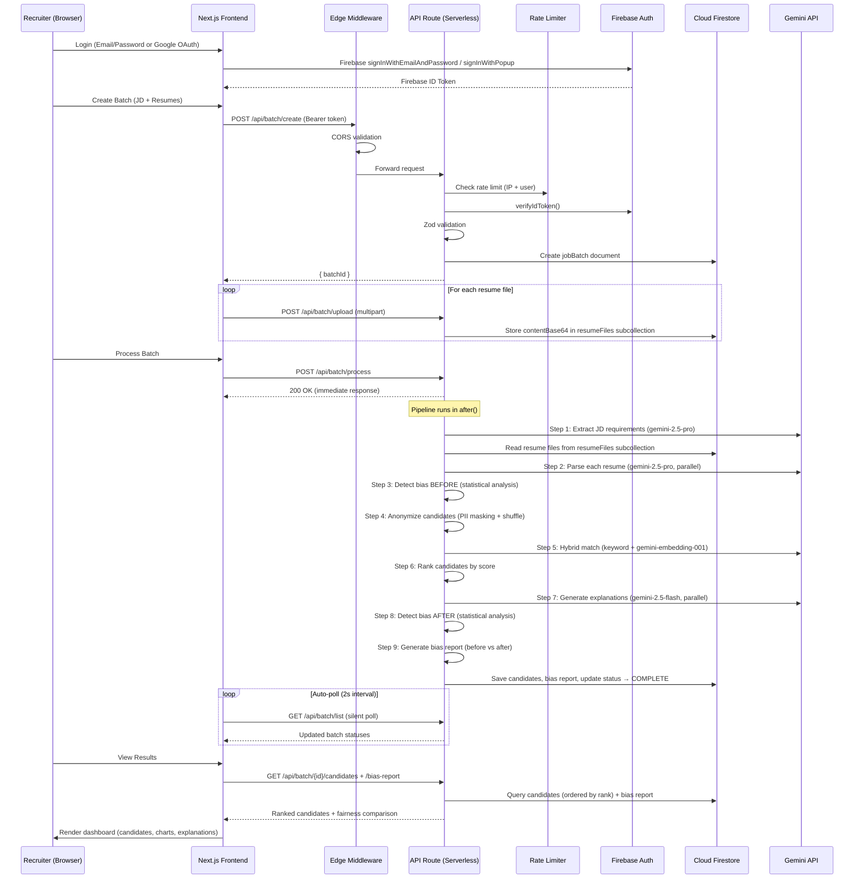

# AptiCore: Technology Stack & Architecture

> **Version:** 2.0 · **Last Updated:** April 15, 2026  
> **Status:** Production-ready · Reflects the actual implemented system.

This document describes the complete technology stack powering the **AptiCore** platform — an AI Bias Detection & Fair Hiring system built for the **Google Solution Challenge 2026**. The architecture leverages the Google Developer ecosystem end-to-end: Gemini for AI, Firebase for infrastructure, and Next.js on Vercel for fullstack delivery.

---

## 1. Frontend: Landing Page & Recruiter Dashboard

The frontend serves two purposes: a public-facing marketing site (landing page, about) and a private recruiter dashboard for managing hiring batches.

### 1.1 Core Framework

| Technology | Version | Role |
|-----------|---------|------|
| **Next.js** | 15.3.1 | App Router with Server/Client component split, SSR for landing pages, CSR for dashboard interactivity |
| **React** | 19.1.0 | Component architecture with hooks, refs, and concurrent features |
| **TypeScript** | 5.8.3 | End-to-end type safety across frontend + backend (shared `types.ts`) |

- **Why Next.js 15:** App Router enables colocated API routes (`/api/*`), edge middleware for CORS, `after()` for background processing, and streaming responses — all in a single deployment unit. Server Components reduce client JS bundle for landing pages. Client Components power interactive dashboard views.

### 1.2 Styling & Design System

| Technology | Version | Role |
|-----------|---------|------|
| **Tailwind CSS** | 4.1.4 | Utility-first CSS with PostCSS integration |
| **PostCSS** | — | Tailwind CSS build pipeline |

- **Design Tokens:** Custom CSS variables define the design system — `--font-plus-jakarta`, `--font-dm-sans`, `--font-lobster`, brand colors (`brand`, `accent`), surface colors (`surface`, `surface-alt`), ink colors (`ink`, `ink-muted`), and edge borders.
- **Typography:** Three Google Fonts loaded via `next/font/google` with `display: "swap"` for performance:
  - **Plus Jakarta Sans** — Primary body font (`--font-plus-jakarta`)
  - **DM Sans** — Secondary/alternative body font (`--font-dm-sans`)
  - **Lobster** — Brand wordmark only (`--font-lobster`)
- **Responsive Design:** Mobile-first breakpoints with `sm:`, `md:`, `lg:` Tailwind prefixes. Touch-friendly tap targets. Hamburger menu for mobile navigation.

### 1.3 State Management

| Technology | Version | Role |
|-----------|---------|------|
| **Zustand** | 5.0.5 | Lightweight, TypeScript-native state management |

Three independent stores manage all client-side state:

| Store | Responsibilities |
|-------|-----------------|
| `useAuthStore` | Firebase auth lifecycle (`user`, `loading`, `initialized`), `initAuth()` wraps `onAuthStateChanged`, `getIdToken()` for API calls, `logout()` |
| `useBatchStore` | All data operations — CRUD for batches, candidates, bias reports. Features: **optimistic UI** (delete/process), **silent polling** (`pollBatches()` — no loading flicker), **auto-polling** (2s interval during active processing), `apiFetch<T>()` helper with Bearer + CSRF headers |
| `useDashboardStore` | UI view state: `selectedView` (overview \| candidates \| bias-report), `comparisonMode`, `showAnonymized` toggles |

- **Why Zustand over Redux:** Zero boilerplate, excellent TypeScript inference, perfect for small store count (3). No providers, reducers, or action creators needed.

### 1.4 Data Visualization

| Technology | Version | Role |
|-----------|---------|------|
| **Recharts** | 2.15.3 | React-native charting library for bias report visualizations |

Used in the Bias Report tab to render:
- Bar charts for gender distribution (before vs after)
- Bar charts for college tier distribution (before vs after)
- Bar charts for location type distribution (before vs after)
- Radial/progress indicators for fairness scores

### 1.5 UI Component Architecture

**Landing Page Components** (`src/app/components/`):

| Component | Purpose |
|-----------|---------|
| `Header.tsx` | Sticky header with responsive nav, auth-aware account dropdown (Google avatar or email initial), change password modal for email users |
| `Hero.tsx` | "Hire on Skills, Not Stereotypes" hero section with animated dashboard preview, key metrics (35% improvement, <2s per resume, 100% explainable) |
| `HowItWorks.tsx` | 3-step pipeline visualization: Reveal Bias → Remove Bias → Prove Improvement |
| `Features.tsx` | Feature cards: AI Anonymization, Quantifiable Fairness, Full Explainability |
| `SDGImpact.tsx` | UN SDG alignment: Goal 5 (Gender Equality), Goal 8 (Decent Work), Goal 10 (Reduced Inequalities) |
| `FinalCTA.tsx` | "Ready to Make Hiring Fair?" call-to-action with sign-up button |
| `Footer.tsx` | Product/company links, team social profiles (LinkedIn, GitHub) with interactive mobile dropdowns |
| `AuthProvider.tsx` | React context wrapper for Firebase auth state |

**UI Primitives** (`src/app/components/ui/`):

| Component | Purpose |
|-----------|---------|
| `ScrollProgress.tsx` | Page-level reading progress bar (top of viewport) |
| `ParticleBackground.tsx` | Canvas-based animated particle effects for visual flair |
| `RevealOnScroll.tsx` | Intersection Observer wrapper — triggers CSS animations on scroll |
| `SectionHeader.tsx` | Consistent section title + subtitle styling |

**Dashboard Components** (`src/app/dashboard/components/`):

| Component | Purpose |
|-----------|---------|
| `DashboardHeader.tsx` | Welcome message + "New Batch" CTA button |
| `StatsRow.tsx` | Aggregate stats cards (total batches, total candidates, average fairness score) with animated counters |
| `BatchList.tsx` → `BatchCard.tsx` | List of job batches with status badges (color-coded by pipeline stage), action buttons (View, Process, Retry, Delete) |
| `CreateBatchModal.tsx` | Multi-step modal wizard: JD input → resume upload (drag-and-drop) → create batch |
| `CandidateList.tsx` → `CandidateCard.tsx` | Ranked candidates with match score, skill breakdown chips (green=matched, red=missing), AI explanation, raw vs anonymized data toggle |
| `BiasReportView.tsx` | Full before/after comparison with fairness score delta, distribution charts, improvement breakdowns |
| `FairnessScoreCard.tsx` | Large fairness score display with animated counter and improvement delta badge |
| `DistributionChart.tsx` | Recharts-powered distribution visualizations |
| `EmptyState.tsx` | Friendly empty state with illustration when no batches exist |
| `LoadingState.tsx` | Skeleton loading UI with shimmer animations |

**Dashboard Hooks** (`src/app/dashboard/hooks/`):

| Hook | Purpose |
|------|---------|
| `useAnimatedCounter.ts` | Smooth number animation for stats (e.g., fairness score counting up from 0 to 93) |
| `useScrollReveal.ts` | Intersection Observer-based scroll reveal for dashboard cards |

### 1.6 Page Routing

| Route | Type | Auth | Description |
|-------|------|------|-------------|
| `/` | SSR | Public | Landing page (Hero, How It Works, Features, SDG, CTA, Footer) |
| `/about` | SSR | Public | Team bios, mission statement, core principles |
| `/login` | CSR | Public | Email/password + Google OAuth, sign-up toggle, remember me |
| `/forgot-password` | CSR | Public | Email-based password reset flow |
| `/auth/action` | CSR | Public | Firebase auth action handler (email verify, password reset callbacks) |
| `/dashboard` | CSR | Protected | Auth guard redirects to `/login?redirect=...` if unauthenticated |

---

## 2. Backend: API Layer & Pipeline Orchestration

The backend runs entirely as Next.js API Routes (serverless functions on Vercel), eliminating the need for a separate server, container, or Python environment.

### 2.1 API Framework

| Technology | Version | Role |
|-----------|---------|------|
| **Next.js API Routes** | 15.3.1 | RESTful serverless endpoints under `src/app/api/` |
| **Next.js Edge Middleware** | 15.3.1 | CORS enforcement on all `/api/*` routes before handler execution |
| **Next.js `after()`** | 15.3.1 | Background task execution — pipeline runs after 200 response is sent |

- **Why serverless over a dedicated backend:** Single codebase, zero infrastructure management, automatic scaling, instant CI/CD via Vercel GitHub integration. The entire AI pipeline executes within a single serverless invocation (60s timeout on Vercel Pro).

### 2.2 API Route Inventory

| Route | Method | Purpose | Auth | Rate Limit |
|-------|--------|---------|------|------------|
| `POST /api/batch/create` | POST | Create a new job batch with JD text | Bearer + CSRF | 10 req/min |
| `POST /api/batch/upload` | POST | Upload a resume file (multipart/form-data) | Bearer + CSRF | 100 req/min |
| `POST /api/batch/process` | POST | Trigger the 9-step AI pipeline | Bearer + CSRF | 5 req/min |
| `GET /api/batch/list` | GET | List all batches for authenticated user | Bearer | 60 req/min |
| `GET /api/batch/[batchId]` | GET | Get single batch details | Bearer + ownership | 60 req/min |
| `GET /api/batch/[batchId]/candidates` | GET | Get ranked candidate results | Bearer + ownership | 60 req/min |
| `GET /api/batch/[batchId]/bias-report` | GET | Get before/after bias report | Bearer + ownership | 60 req/min |
| `DELETE /api/batch/delete` | DELETE | Delete batch + cascade subcollections | Bearer + CSRF + ownership | 30 req/min |
| `GET/PUT /api/user/profile` | GET/PUT | Read or update user profile | Bearer | 30 req/min |
| `GET /api/health` | GET | Health check / liveness probe | None | 30 req/min |

### 2.3 Request/Response Contract

**Standardized envelope** on every response (enforced via `api-response.ts`):

```json
{
  "success": true | false,
  "data": { ... } | null,
  "error": "Human-readable message" | null
}
```

**Error handling hierarchy** (via `handleApiError()`):
1. `AuthError` → 401/403 with auth message
2. `ZodError` → 400 with field-level validation messages
3. Generic `Error` → 500 with "Internal server error" (no stack leakage)

### 2.4 Input Validation

| Technology | Version | Role |
|-----------|---------|------|
| **Zod** | 4.3.6 | Runtime request body validation with TypeScript type inference |

**Validation Schemas** (`src/lib/validation.ts`):

| Schema | Constraints |
|--------|------------|
| `CreateBatchSchema` | `jdText`: string, 50–10,000 chars · `fileCount`: int, 1–50 |
| `ProcessBatchSchema` | `batchId`: string, 1–128 chars |
| `DeleteBatchSchema` | `batchId`: string, 1–128 chars |
| `UpdateProfileSchema` | `displayName`, `company`, `role`: optional strings, max 100 chars, trimmed |

---

## 3. Core AI & Machine Learning Pipeline

The AI pipeline is the operational heart of AptiCore. It runs entirely in JavaScript/TypeScript — no Python, no heavy ML libraries, no containerized models — keeping the system lightweight and Vercel-compatible.

### 3.1 AI Provider Architecture

| Technology | Version | Role |
|-----------|---------|------|
| **@google/generative-ai** | 0.24.1 | Official Google Generative AI SDK for Gemini API access |

**Provider Pattern** (`src/lib/ai/provider.ts`):
- `IAIProvider` interface with `complete()` and `generateEmbeddings()` methods.
- `GeminiProvider` class implements the interface as a **singleton** (SDK + model instances cached).
- Abstraction layer allows swapping providers without changing business logic.

### 3.2 Model Configuration

| Model | Task | Temperature | Max Tokens | JSON Mode |
|-------|------|-------------|------------|-----------|
| `gemini-2.5-pro` | Resume parsing (structured extraction) | 0 | 4,096 | ✅ |
| `gemini-2.5-pro` | JD requirement extraction | 0 | 2,048 | ✅ |
| `gemini-2.5-flash` | Explanation generation | 0.2 | 300 | ❌ |
| `gemini-embedding-001` | Semantic skill matching (vector embeddings) | — | — | — |

- **Why Pro for parsing:** Resume and JD parsing require high accuracy for structured JSON extraction. Zero temperature (0) ensures deterministic, consistent output.
- **Why Flash for explanations:** Explanations are simpler text generation that benefit from speed over depth. Slightly higher temperature (0.2) allows natural language variation.
- **Why separate embedding model:** `gemini-embedding-001` is Google's current recommended embedding model — dedicated to producing high-quality vector representations.

### 3.3 Reliability & Resilience

**Exponential Backoff Retry** (`withRetry()`):
- Max 3 retries with delays: 1s → 2s → 4s + random jitter (0–500ms)
- Retryable HTTP codes: `429` (rate limit), `500` (server error), `503` (service unavailable), `408` (timeout)
- Transient error detection: `ECONNRESET`, `ECONNREFUSED`, `socket hang up`, `fetch failed`, `timeout`, `network`, `aborted`
- Non-retryable errors (400, 401, 403) fail immediately.

**Graceful Degradation:**
- If semantic embedding fails → falls back to keyword-only matching (no score boost)
- If explanation generation fails → falls back to template: `"Scored {X}% based on skill matching."`
- If individual resume parsing fails → creates placeholder candidate with `PARSE_FAILED` status

**Input Safety:**
- Resume text truncated to 15,000 chars (≈3,750 tokens)
- JD text truncated to 10,000 chars (≈2,500 tokens)
- JSON mode (`responseMimeType: "application/json"`) enforces structured output

### 3.4 Pipeline Modules

#### Resume Parser (`src/lib/gemini.ts` — `parseResume()`)
- **Input:** Raw text extracted from PDF/DOCX/TXT
- **Output:** `CandidateRawData` — structured JSON with name, email, phone, gender, college (with tier), location (with type), skills (8 categories, normalized), experience, projects, education, summary
- **Gender Detection Rule:** Only from explicit pronouns (he/him → male, she/her → female, they/them → non-binary). **Never from names.** Defaults to "unknown."
- **Skill Normalization:** "ReactJS" → "React", "NodeJS" → "Node.js", "k8s" → "Kubernetes"

#### JD Extractor (`src/lib/gemini.ts` — `extractJDRequirements()`)
- **Input:** Raw JD text
- **Output:** `JDRequirements` — title, requiredSkills, preferredSkills, minimumExperience, educationLevel, description
- **Classification Logic:** "Must have" signals → required, "Nice to have" → preferred. Ambiguous: 60/40 split.

#### Anonymizer (`src/lib/anonymizer.ts`)
- **PII Stripping:** Emails, phones, URLs, LinkedIn/GitHub profiles → placeholder tokens
- **Identity Masking:** Institution names (IIT, NIT, IIIT, BITS, ISI) → `[INSTITUTION]`, gendered pronouns → "they"
- **Candidate IDs:** `C-001`, `C-002`, etc.
- **Order Shuffling:** Array randomized to prevent position-based inference
- **Regex Safety:** Factory functions create fresh `/g` RegExp instances per call to avoid stateful `lastIndex` bugs

#### Hybrid Matcher (`src/lib/matcher.ts`)
- **Keyword Matching (base):**
  - Exact match via `Set<string>` (O(1))
  - Alias match via pre-computed `REVERSE_ALIAS_MAP` (60+ alias pairs, bidirectional)
  - Substring fallback for partial matches
  - Confidence scoring: exact = 1.0, alias = 0.75, substring = 0.85
- **Semantic Matching (boost):**
  - Candidate skills + JD skills → `gemini-embedding-001` → vector embeddings
  - Cosine similarity computed in pure JS (dot product / magnitude normalization)
  - Converted from [-1, 1] → [0, 100] scale
  - Boost = `(semanticScore / 100) × 15` → up to +15 points on top of keyword score
- **Scoring Formula:**
  - Required skills matched: `(matched / total) × 70`
  - Preferred skills matched: `(matched / total) × 20`
  - Experience bonus: `min(candidateYears / requiredYears, 1) × 10`
  - Final: `min(requiredScore + preferredScore + expScore + semanticBoost, 100)`

#### Bias Detection Engine (`src/lib/bias-engine.ts`)
- **Before Analysis:** Simulates traditional biased pipeline with weighted identity factors → selects top 50% → measures demographics of that biased selection
- **After Analysis:** Takes AptiCore's skill-ranked top 50% → measures demographics
- **Fairness Score Calculation:**
  - Gender Parity (30%): min/max ratio of male vs female
  - College Bias Index (25%): 1 - normalized Shannon entropy
  - Location Bias Index (20%): 1 - normalized Shannon entropy
  - Non-Skill Weight (25%): average of bias indices, reduced by -0.15 for skill-based pipeline
- **Bias Report Generation:** Computes deltas for 4 metrics (Gender Parity, College Bias, Location Bias, Merit Purity) with contextual improvement descriptions

#### Explainability Engine (`src/lib/gemini.ts` — `generateExplanation()`)
- 2–3 sentence explanation per candidate: score summary → matched skills → gaps
- Never reveals identity (name, gender, college, location)
- Uses Gemini 2.5 Flash for speed

### 3.5 File Processing (`src/lib/pdf-parser.ts`)

| Format | Library | Method |
|--------|---------|--------|
| **PDF** | `pdf-parse` (v1.1.1) | Binary buffer → `pdf(buffer)` → extracted text |
| **DOCX** | `JSZip` (v3.10.1) | ZIP archive → `word/document.xml` → `<w:t>` tag extraction → paragraph assembly |
| **TXT** | Native `Buffer.toString()` | UTF-8 decoding with BOM handling |

**File Detection:**
- Primary: Magic byte analysis — `%PDF` (PDF), `PK` + `word/` marker (DOCX), UTF-8 BOM (TXT)
- Fallback: File extension tiebreaker when magic bytes are ambiguous
- Safety: ZIP files without `word/` directory rejected (prevents XLSX/PPTX misidentification)

**Constraints:**
- Max file size: 10MB per file
- Max files per batch: 50
- Scanned PDFs: Detected via text length < 50 chars → returns `NEEDS_OCR` status

---

## 4. Database & Storage (Firebase / Google Cloud)

### 4.1 Authentication

| Service | Configuration |
|---------|--------------|
| **Firebase Authentication** | Email/password + Google OAuth (Sign-In with Google) |

- Server-side token verification via `firebase-admin` SDK (`adminAuth.verifyIdToken()`)
- Client-side auth state via `onAuthStateChanged()` → Zustand store
- Auth providers configured in `firebase.json`

### 4.2 Database

| Service | Version | Configuration |
|---------|---------|--------------|
| **Cloud Firestore** | via `firebase-admin` 13.8.0 | `nam5` region, `(default)` database |

**Data Model:**

```
📁 users/{userId}
│   email, displayName, company, role
│   batchCount (FieldValue.increment)
│   createdAt, updatedAt

📁 jobBatches/{batchId}
│   userId, jdText, jdRequirements (JDRequirements)
│   status (ProcessingStatus — 11 possible states)
│   candidateCount, fairnessScoreBefore, fairnessScoreAfter
│   createdAt, completedAt, error
│
├── 📁 candidates/{candidateId}
│       batchId, rawData, anonymizedData
│       matchScore, semanticBoost, skillBreakdown
│       explanation, rank
│       parseStatus, parseError
│
├── 📁 biasReport/report          (singleton document)
│       before (BiasMetrics), after (BiasMetrics)
│       improvements[] (BiasImprovement[])
│       overallImprovement
│
├── 📁 resumeFiles/{fileId}       (server-only, raw content)
│       fileName, contentBase64, size
│
└── 📁 resumes/{resumeId}         (server-only, metadata)
        fileName, storagePath, size, uploadedAt
```

**Write Patterns:**
- All batch/candidate/report writes via **Admin SDK** (server-side only) — clients are read-only
- Batched writes chunked to respect Firestore's 500-operation-per-commit limit
- `stripUndefined()` utility recursively removes `undefined` values before write (Firestore rejects them)
- `safeQuery()` wrapper handles `NOT_FOUND` (gRPC 5) and `FAILED_PRECONDITION` (gRPC 9) gracefully

**Query Indexes** (defined in `firestore.indexes.json`):
- `jobBatches` → composite index on `userId` + `createdAt` (desc) for user batch listing
- `candidates` → index on `rank` (asc) for ranked candidate retrieval

### 4.3 File Storage

| Service | Configuration |
|---------|--------------|
| **Firebase Storage** | Default bucket, security rules enforced |

- Resume uploads stored at `batches/{batchId}/resumes/{fileName}`
- Current implementation: files stored as **base64 in Firestore** (`resumeFiles` subcollection) for hackathon simplicity — avoids signed URL complexity
- Storage rules enforce: authenticated uploads only, 10MB max, PDF/DOCX content types, no client updates/deletes

### 4.4 Firestore Security Rules

```
Default: deny all
users/{userId}    → read/write only by owner, immutable fields protected
jobBatches/{batchId}  → read only by owner, all writes server-side
  /candidates     → read by batch owner, write server-side
  /biasReport     → read by batch owner, write server-side
  /resumeFiles    → no client access (server-only)
  /resumes        → no client access (server-only)
```

---

## 5. Security Architecture

### 5.1 Multi-Layer Security Stack

| Layer | Technology | Implementation |
|-------|-----------|---------------|
| **Edge CORS** | Next.js Middleware | Runs before every `/api/*` request. Validates `Origin` header against allowlist (`CORS_ALLOWED_ORIGINS` env var). Rejects unknown origins with 403. Handles OPTIONS preflight with proper `Access-Control-*` headers. Dev mode auto-allows localhost. |
| **Authentication** | Firebase Admin SDK | `verifyAuth()` extracts Bearer token from `Authorization` header, verifies via `adminAuth.verifyIdToken()`. Returns `{ uid, email, name }` or throws 401. |
| **CSRF Protection** | Custom header check | All mutation requests (POST/PUT/DELETE) must include `X-Requested-With: XMLHttpRequest`. Simple cross-origin form POSTs cannot set custom headers — this blocks CSRF attacks. |
| **Rate Limiting** | In-memory token bucket | Composite keys: `{IP}:{userId?}:{category}`. 7 categories with configurable limits. Response headers: `X-RateLimit-Limit`, `X-RateLimit-Remaining`, `X-RateLimit-Reset`, `Retry-After`. Stale bucket cleanup every 5 min. |
| **Ownership** | `verifyOwnership()` | Every batch operation checks `batch.userId === request.uid`. Prevents cross-user data access. |
| **Input Validation** | Zod v4 | Request bodies validated against schemas before processing. Type-safe error messages returned. |
| **Security Headers** | `next.config.ts` | `X-Content-Type-Options: nosniff`, `X-Frame-Options: DENY`, `X-XSS-Protection`, `Referrer-Policy: strict-origin-when-cross-origin`, `HSTS: max-age=63072000`, `Permissions-Policy: camera=(), microphone=(), geolocation=()` |
| **Open Redirect Prevention** | Login page logic | Redirect URL validated against internal paths — external URLs rejected |
| **Email Enumeration Prevention** | Auth routes | Generic error messages on login/signup — no user existence leakage |

### 5.2 Rate Limit Configuration

| Category | Limit | Purpose |
|----------|-------|---------|
| `create` | 10/min | Batch creation rate |
| `upload` | 100/min | Resume upload rate (multiple files per batch) |
| `process` | 5/min | AI pipeline invocations (most expensive) |
| `read` | 60/min | GET operations for batches, candidates, reports |
| `write` | 30/min | Profile updates, data mutations |
| `auth` | 5/min | Login/signup attempts |
| `health` | 30/min | Health check endpoint |

All configurable via environment variables: `RATE_LIMIT_CREATE`, `RATE_LIMIT_UPLOAD`, etc.

---

## 6. Development & DevOps

### 6.1 Build & Tooling

| Tool | Version | Purpose |
|------|---------|---------|
| **TypeScript** | 5.8.3 | Strict type checking across entire codebase |
| **ESLint** | 9.25.1 | Code quality linting with `eslint-config-next` |
| **PostCSS** | — | Tailwind CSS build pipeline |
| **Node.js** | 18+ | Runtime for Next.js dev server and API routes |

### 6.2 Deployment

| Component | Platform | Configuration |
|-----------|----------|---------------|
| **Fullstack App** | Vercel | Auto-deploy on `git push`, preview URLs per branch, serverless functions |
| **Firestore** | Google Cloud | `nam5` region, security rules deployed via `firebase deploy` |
| **Authentication** | Firebase | Email/password + Google OAuth configured in Firebase Console |
| **Storage** | Firebase Storage | Security rules deployed via `firebase deploy` |

### 6.3 Environment Variables

| Variable | Required | Purpose |
|----------|----------|---------|
| `GOOGLE_GEMINI_API_KEY` | ✅ | Gemini API authentication |
| `FIREBASE_PROJECT_ID` | ✅ | Firebase project identifier |
| `FIREBASE_CLIENT_EMAIL` | ✅ | Service account email |
| `FIREBASE_PRIVATE_KEY` | ✅ | Service account private key (base64/PEM) |
| `NEXT_PUBLIC_FIREBASE_API_KEY` | ✅ | Client-side Firebase config |
| `NEXT_PUBLIC_FIREBASE_AUTH_DOMAIN` | ✅ | Client-side auth domain |
| `NEXT_PUBLIC_FIREBASE_PROJECT_ID` | ✅ | Client-side project ID |
| `NEXT_PUBLIC_FIREBASE_STORAGE_BUCKET` | ✅ | Client-side storage bucket |
| `NEXT_PUBLIC_FIREBASE_MESSAGING_SENDER_ID` | ✅ | Client-side messaging sender |
| `NEXT_PUBLIC_FIREBASE_APP_ID` | ✅ | Client-side app ID |
| `CORS_ALLOWED_ORIGINS` | ✅ (prod) | Comma-separated allowed CORS origins |
| `RATE_LIMIT_*` | ❌ | Per-category rate limit overrides |

### 6.4 Observability

| Feature | Implementation |
|---------|---------------|
| **Structured Logging** | Custom `logger` module with `info`, `warn`, `error`, `debug` levels. Includes metadata objects for structured debugging. |
| **Pipeline Timers** | `createTimer()` utility measures step-by-step pipeline duration. Logs total elapsed time on completion. |
| **Parse Error Tracking** | Failed resume parses logged with filenames and error details. Tracked in candidate results as `parseStatus: "PARSE_FAILED"`. |

---

## 7. Architecture Flow Diagram



---

## 8. Performance Optimizations

| Optimization | Where | Impact |
|-------------|-------|--------|
| **Parallel resume parsing** | `processInBackground()` | `Promise.allSettled()` on all resumes simultaneously — linear → constant time |
| **Parallel hybrid matching** | `processInBackground()` | All candidates matched concurrently |
| **Parallel explanation generation** | `processInBackground()` | All explanations generated concurrently |
| **Resume deduplication** | `processInBackground()` | DJB2 content hash → cache prevents duplicate Gemini API calls |
| **O(1) skill lookups** | `matcher.ts` | `Set<string>` for exact match, `Map<string, Set>` for alias lookup |
| **Reverse alias map** | `matcher.ts` | Pre-computed bidirectional map (built once at module load) for 60+ skill pairs |
| **SDK instance caching** | `ai/provider.ts` | Singleton `GoogleGenerativeAI` and model instances |
| **Silent polling** | `store.ts` | `pollBatches()` updates without triggering loading state — no card flicker |
| **Optimistic UI** | `store.ts` | Batch deletes and process starts reflected instantly, rolled back on failure |
| **Background processing** | `after()` | Client gets 200 immediately; heavy pipeline runs asynchronously |
| **Chunked Firestore writes** | `firestore.ts` | Respects 500-op batch limit by splitting large write sets |
| **Module-level hoisting** | Throughout | RegExp patterns, education maps, alias maps, constants initialized once |
| **`serverExternalPackages`** | `next.config.ts` | `pdf-parse` excluded from Webpack bundling — loaded as native Node module |

---

## 9. Dependency Summary

### Production Dependencies

| Package | Version | Purpose |
|---------|---------|---------|
| `next` | ^15.3.1 | Fullstack React framework (App Router, API Routes, Edge Middleware) |
| `react` / `react-dom` | ^19.1.0 | UI component library |
| `firebase` | ^11.6.0 | Client-side Firebase SDK (Auth, Firestore reads) |
| `firebase-admin` | ^13.8.0 | Server-side Firebase Admin SDK (token verification, Firestore writes) |
| `@google/generative-ai` | ^0.24.1 | Google Gemini API SDK (Pro, Flash, Embeddings) |
| `@google-cloud/storage` | ^7.16.0 | Google Cloud Storage SDK for resume file storage |
| `@google-cloud/vertexai` | ^1.9.3 | Vertex AI SDK (available for future model expansion) |
| `zod` | ^4.3.6 | Runtime schema validation with TypeScript inference |
| `zustand` | ^5.0.5 | Lightweight state management (3 stores) |
| `recharts` | ^2.15.3 | React charting library for bias visualizations |
| `pdf-parse` | ^1.1.1 | PDF text extraction |
| `jszip` | ^3.10.1 | DOCX (ZIP archive) text extraction |

### Development Dependencies

| Package | Version | Purpose |
|---------|---------|---------|
| `typescript` | ^5.8.3 | Type checking and compilation |
| `tailwindcss` | ^4.1.4 | Utility-first CSS framework |
| `@tailwindcss/postcss` | ^4.1.4 | PostCSS integration for Tailwind |
| `eslint` / `eslint-config-next` | ^9.25.1 / ^15.3.1 | Code linting |
| `@types/node` | ^22.14.1 | Node.js type definitions |
| `@types/react` / `@types/react-dom` | ^19.1.2 | React type definitions |